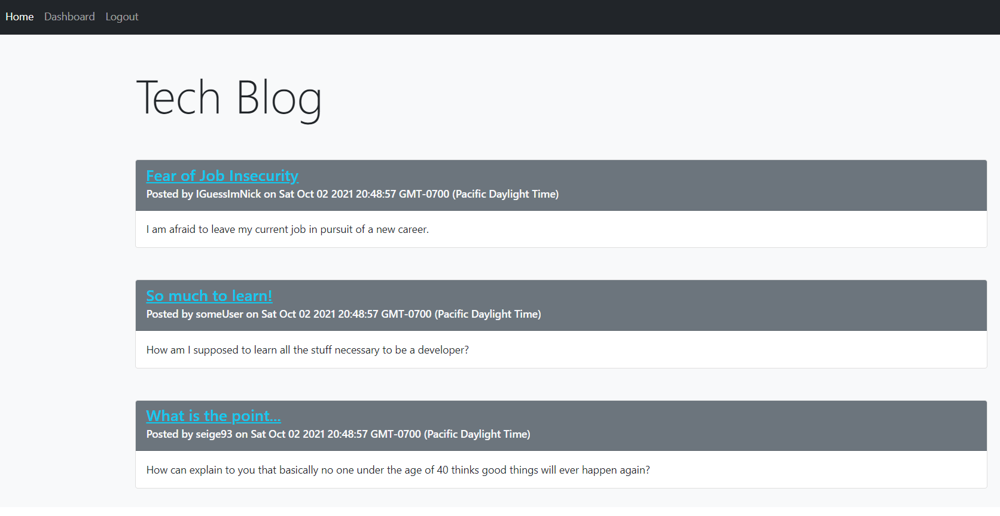

# homework-14-tech-blog

-----------
# Description
This app is a mock blog spot where users can post and edit new entries, or commet on exiting ones. 

-----------

## Operations
1. Initialize the database
    a. create a .env file and populate with a DB_USER, DB_PW, and DB_NAME (npm dotenv will take this information)
    b. run MySQL and load the schema.sql
    c. exit MySQL
    d. <npm run seed> to seed the database
2. Start the server
    a. <npm start>
3. Naviagate to https://homework-14-my-tech-blog.herokuapp.com/

-----------
## Tech/Framework
Built with:
    * JavaScript
    * SQL
    * Express.js
    * NPM: express, mysql2, sequelize, dotenv, bcrypt, sessions handlebars
    * Node.js

-----------
## Authors and Acknowledgment
* Nick Skinner
* I'd like to thank the UC Davis coding bootcamp team for answering all my questions regarding this project.

-----------
## Known Errors
* CSS does not load at time of deployment
* database not yet functional with JAWSDB. This causes no other blog posts to initially populate when you load the heroku website. This problem can be circumvented by starting the server and navigating to http://localhost:"PORT"/

-----------
## License
Copyright [2021] [##Authors]

Licensed under the Apache License, Version 2.0 (the "License");
you may not use this file except in compliance with the License.
You may obtain a copy of the License at

    http://www.apache.org/licenses/LICENSE-2.0

Unless required by applicable law or agreed to in writing, software
distributed under the License is distributed on an "AS IS" BASIS,
WITHOUT WARRANTIES OR CONDITIONS OF ANY KIND, either express or implied.
See the License for the specific language governing permissions and
limitations under the License.